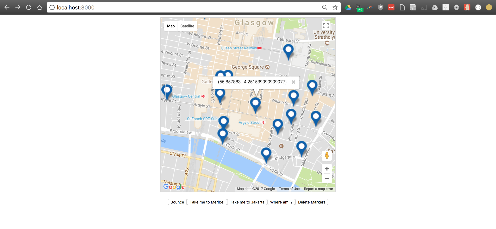

# **Google Maps API**    

## Mapping routes:    

This mini project stemmed from a lab class at CodeClan in Glasgow. Data was retrieved from the Tour Guider API (http://tour-guider.herokuapp.com/api/tours/2) using an XMLHttpRequest, event listeners and callbacks. A mapWrapper Google Map was created using the Google Maps API (https://maps.googleapis.com/maps/api/js) with associated HTML buttons:

* Bounce Markers - animated marker bouncing
* Take me to Meribel - map centres on location
* Take me to Jakarta - map centres on location
* Where am I? - map centres on device location (using navigator.geolocation)
* Delete Markers - deletes last marker in markers array

The Tour Guider API data was visualised by dynamically creating and adding Markers to the Google Map using JavaScript. InfoWindows were created dynamically for each Marker on create. The HTML was then basically styled using CSS by targeting classes and ids that were dynamically assigned during element creation.  

## Built With:  
* JavaScipt   
* Google Maps API (https://maps.googleapis.com/maps/api/js)   
* Tour Guider API (http://tour-guider.herokuapp.com/api/tours/2)  

## Authors  
* Peter McCready - Initial work    
